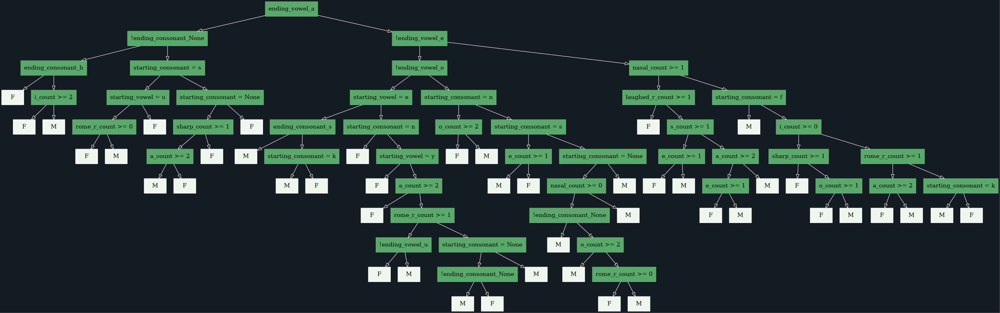
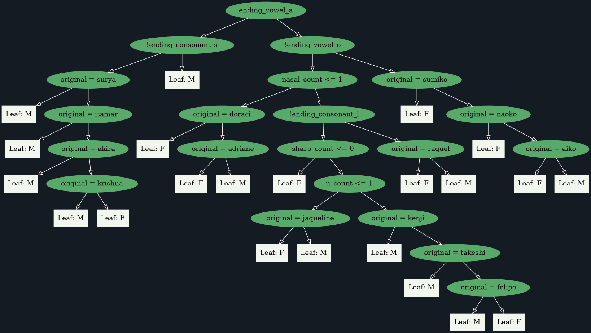

# Decision Tree Algorithm

## TODO

- [ ] port to C
- [ ] port to JavaScript
- [ ] make an interactive website and collect feedback
- [ ] make a LinkedIn post about this
- [x] expand the training set
- [x] add more features to the model

## Version 2.0

**Training set length:** 807 rows

### Model features

1. ends_in_vowel
2. nasal_count
3. sharp_count
4. {_vowel_}\_count
5. {_pronounciation_}\_r_count
6. ends_in_vowel
7. ending*vowel*{_vowel_}
8. ending*consonant*{_h, l, m, m, n, r, s, z or null_}
9. starts_in_vowel
10. starting*vowel*{_vowel_}
11. starting*consonant*{_consonant_}
12. s_count

### Preview

## Version 1.0

**Training set length:** 164 rows

### Model features

1. original
2. ends_in_vowel
3. nasal_count
4. sharp_count
5. {_vowel_}\_count
6. {_pronounciation_}\_r_count
7. ending*vowel*{_vowel_}
8. ending*consonant*{_h, l, m, m, n, r, s, z or null_}

### Preview

---

Special thanks to my professors, [@Thiago Inocêncio](https://github.com/ThiagoInocencio) and [@Carlos Veríssimo](https://github.com/ProfVerissimoFatec) for nurturing my interest in discovering new ways to bang my head against a computer screen. And for the patience to answer my never ending questions.
