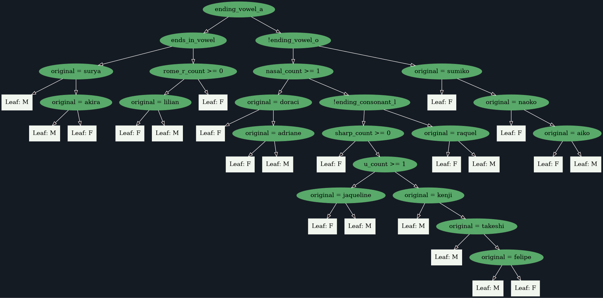

# Decision Tree Algorithm

## TODO

- [ ] port to C
- [ ] port to Java
- [ ] port to JavaScript
- [ ] make an interactive website and collect feedback
- [ ] make a LinkedIn post about this
- [ ] expand the training set
- [ ] add more features to the model

## Version 1.0

**Training set length:** 164 rows

### Model features

1. original
2. ends_in_vowel
3. nasal_count
4. sharp_count
5. {_vowel_}_count
6. {_pronounciation_}_r_count
7. ending_vowel_{_vowel_}
8. ending_consonant_{_h, l, m, m, n, r, s, z or null_}

### Result

---

Special thanks to my professors, [@Thiago Inocêncio](https://github.com/ThiagoInocencio) and [@Carlos Veríssimo](https://github.com/ProfVerissimoFatec) for nurturing my interest in discovering new ways to bang my head against a computer screen. And for the patience to answer my never ending questions.
